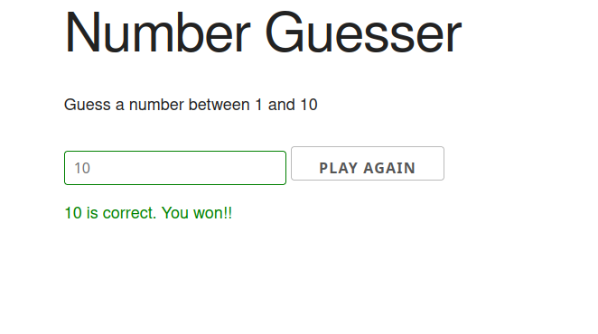

# Number guesser
A toy app that generates a random number and offers the user some chances to guess it.

It uses no JS frameworks, just vanilla JavaScript.

Click [here](https://lifebalance.github.io/number-guesser/) to see it **live**!

## Dependencies:

* [Skeleton 2.0.4](http://getskeleton.com/)
